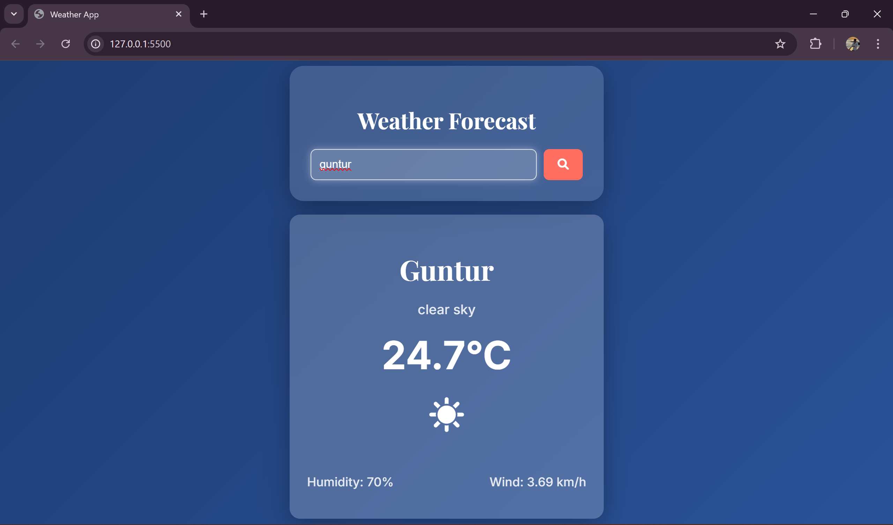

# 🌦️ Weather App

A simple and responsive Weather App built using **HTML, CSS, and JavaScript** that fetches real-time weather data using external APIs. This project highlights my skills in **frontend development, API integration, and asynchronous JavaScript**.

---

## 📌 Project Overview

The Weather App allows users to search for current weather conditions by entering a city name. It displays temperature, humidity, wind speed, and a brief weather description with a clean and modern UI.

---

## ✨ Key Features

- 🌍 **Search by City:** Get weather updates for any city worldwide.  
- 🌡️ **Real-time Data:** Uses an API to fetch current weather data.  
- 📊 **Detailed Info:** Shows temperature, humidity, wind speed, and weather conditions.  
- 🎨 **Responsive UI:** Built with HTML and CSS for a clean look on all devices.  
- ⚡ **Asynchronous JS:** Fetch API used for non-blocking requests.  
- 🚫 **Error Handling:** Displays messages for invalid city names or API issues.  

---

## 🛠️ Tech Stack

- **Frontend:** HTML, CSS, JavaScript  
- **API:** OpenWeatherMap API (or specify the API you used)  
- **HTTP Requests:** Fetch API (JavaScript)  

---

## 📦 Dependencies

No external libraries required.  
Only a valid API key is needed.

---

## 🖥️ Usage

- Enter a city name in the search bar and click "Get Weather".  
- View current temperature, humidity, wind speed, and a brief description of the weather.  
- Error messages will appear for invalid city names or connectivity issues.  

### 🌟 **Screenshot**
  

